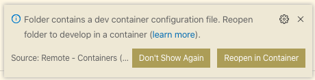

# SC Plus Shared Component Library

SC Plus shared component library aims to offer reusable components to unify the UI for all Select Quote applications.

---

## Viewing the Storybook

The latest version of the Shared Component Library Storybook can be viewed at:

`https://scplus-shared-components.selectquotelabs.com/`

## Contributing

When you make changes to this repo, you must adhere to the [Conventional Commit](https://www.conventionalcommits.org/en/v1.0.0/#summary) standard.

If you are unfamiliar with writing [Conventional Commit](https://www.conventionalcommits.org/en/v1.0.0/#summary) style messages, you can use the [commitizen](https://commitizen.github.io/cz-cli/) to guide you through creating the commit message

```sh
git add .
npx git-cz
```

> You can also use `npm run commit` instead of `npx git-cz` if that's easier to remember.

When you are familiar with how commits should be structured, feel free to use `git commit -m` for quick things, for example:

```sh
git commit -m “chore(rounded button): added boilerplate”
```

The commit will be validated through a linter pre-commit hook and will reject any commit messages that do not properly adhere to the convention.

[Conventional Commit](https://www.conventionalcommits.org/en/v1.0.0/#summary) formatted messages are required for proper versioning and automatic generation of release notes / CHANGELOG. Check out the documentation if you want to learn more about what commits trigger a version change.

## Consuming

### Initial Setup

To use a component from the shared components library, add the library as a dependency in the package.json.

Ideally, the SSC version consumed is managed by the technical lead. Replace the X.X.X at the end of the URL below with the version you are wanting to consume. You can look at the Changelog.md for a full list of all versions and what was in each.

```json
"scplus-shared-components": "https://npm-public.selectquotelabs.com/scplus-shared-components/X.X.X",
```

To standardize our CSS global styles, replace the following CSS files with the their Shared Component Library counterparts.

- root.css
- animations.css
- typography.css
- utilClasses.css

From the `client/src/index.js` of the consumer codebase import the `index.css` from SSC.

The `index.css` file from SSC imports the 4 CSS files above.

```js
import 'scplus-shared-components/dist/index.css';
```

Delete the four CSS files listed above from the consumer codebase

### Using a Shared Component

From the file you want to consume a shared component, import the component:

```js
import {Avatar} from 'scplus-shared-components';
```

---

## Development

### Prerequisites

This project leverages Docker and docker-compose. Docker and docker-compose must be installed installed to run this project.

### Local Development

Install Visual Studio Code and the Remote Development Extension

```sh
code --install-extension ms-vscode-remote.remote-containers
```

Now you can open the folder containing this repo in VS Code and you'll be presented with an option to Reopen the folder in a container.



The benefit of running inside a container is that your development environment will have the exact same tooling as the build pipeline in Bitbucket.

The development container will automatically run the storybook container (scplus-shared-components) and you can access it at https://localhost:6006

<sup><i>It may take a little while for the service to start. Storybook does a full build every time it starts, and you can monitor the logs from the storybook container to see the progress.</i></sup>

> Note: You can still use other IDEs (such as WebStorm) if you prefer and completely ignore containerization of your development environment.
>
> However, running in a container is the preferred approach since we can control all the environment variables.
>
> **Any technical issues you encounter when developing outside of the container will be your responsibility.**

### Installing and Running

> Note: This is done automatically if you use the Development Container while developing locally. These instructions allow you to start the container independent from the Development Container.

If you want to Pull an existing Docker image you can pass the VERSION property with the Docker image tag you want to pull down.

```properties
VERSION=1.0 docker-compose pull scplus-shared-components
```

To build the projects docker image run(optional to prepend with VERSION=\<tag\>):

```sh
docker-compose build scplus-shared-components
```

You can then run the project locally with:

```sh
docker-compose up scplus-shared-components
```

Then navigate to http://localhost:6006

### Deprecating Components and Props

As we migrate components from divisional code into the shared components we have an opportunity to rewrite and unify the API. We may choose to replace certain components entirely or change the name of props to bring them inline with our conventions.

Also, we have historically found ourselves in a position where our conventions changed and we felt like we couldn't update any components because we were afraid they may break if we do.

A few helpers HOC's have been introduced to deal with these types of situations:

#### Fully Deprecating a Component

```js
import {deprecateComponent} from 'helpers/deprecation';

// ... code for component here

// Originally, we may have simply exported the component:
// export default Component

// Instead, we're going to wrap it in 'deprecateComponent':
export default deprecateComponent(
  Component,
  false /* isMarkedForFailure: setting this to false simply warns */
  /* optionally provide a deprecation message here */
);
```

#### Deprecating Individual Props on a Component

```js
import {deprecateProps} from 'helpers/deprecation';

// ... code for component here

// Originally, we may have simply exported the component:
// export default Component

// Instead, we're going to wrap it in 'deprecateProps':
export default deprecateComponent(
  Component,
  {
    isMarkedForFailure: false /* Warn that his prop is deprecated */,
    deprecatedProp: 'disabled' /* Prop that is deprecated */,

    /* The value of 'disabled' will be assigned to 'isDisabled' */
    replacementProp: 'isDisabled',
  },
  {
    /* Throw an error if this prop is assigned */
    isMarkedForFailure: true,
    deprecatedProp: 'onClick',

    /* Custom error message for explaining the deprecation */
    deprecationMessage: `Component.onClick has been fully deprecated because users do not expect to be able to click on Component elements.

      Consider wrapping Component in a button to clarify the intent to users.`,
  }
);
```

## Running the tests and lint

```sh
docker-compose run test
```

## Contributing

To contribute documentation for future components you can [clone this JIRA](https://selectquote.atlassian.net/browse/SSC-1).

For adding new components to the library follow this order:

1. Make changes locally on a feature branch following the [PR process.](https://selectquote.atlassian.net/wiki/spaces/SE/pages/839516288/Pull+Requests)
2. Run the storybook site locally and confirm all changes.
3. Add complete story to properly document component.
4. Run the tests.
5. Merge your feature branch with origin/master (To be fixed in the near future)
6. Open a PR to the master branch.

## Versioning

We use [SemVer](http://semver.org/) for versioning. For the versions available, see the [tags on this repository](https://bitbucket.org/SelectQuote/scplus-shared-components/src/master/).
